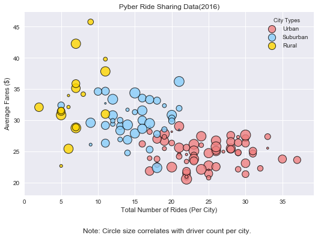
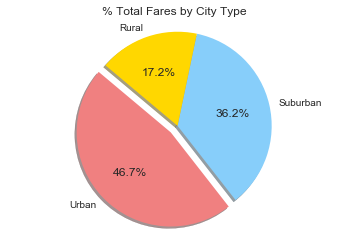
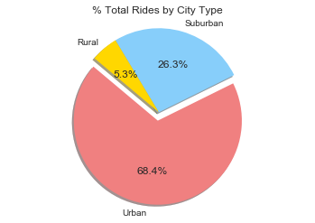
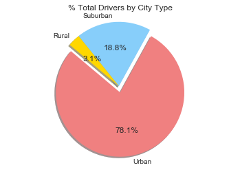

```python
#Import libraries
from matplotlib import pyplot as plt
from scipy import stats
import numpy as np
import pandas as pd
import seaborn as sns
```


```python
#Read city data
city_data = pd.read_csv("Generators/Pyber/generated_data/city_data.csv")
city_data = city_data.rename(columns={"type":"City Types"})
```


```python
#read ride data
ride_data = pd.read_csv("Generators/Pyber/generated_data/ride_data.csv")
```


```python
#from ride_data pull fare column and calculate mean
avgfare = ride_data.groupby(["city"]).mean()
avgfare.pop("ride_id")
avgfare.reset_index(inplace=True)
```


```python
# from ride_data pull count how many rides per city
ridecount = ride_data.groupby(["city"]).count()
ridecount.pop("date")
ridecount.pop("fare")
ridecount = ridecount.rename(columns={"ride_id":"Number of Rides"})
ridecount.reset_index(inplace=True)
```


```python
# merge average fare and ride count columns
afare_crides = pd.merge(avgfare, ridecount, left_on="city", right_on="city")
```


```python
# merge columns and make final table to create graph
taxi_data = pd.merge(city_data, afare_crides, left_on="city", right_on="city")
taxi_data.head()
```


<div>
<style>
    .dataframe thead tr:only-child th {
        text-align: right;
    }

    .dataframe thead th {
        text-align: left;
    }

    .dataframe tbody tr th {
        vertical-align: top;
    }
</style>
<table border="1" class="dataframe">
  <thead>
    <tr style="text-align: right;">
      <th></th>
      <th>city</th>
      <th>driver_count</th>
      <th>City Types</th>
      <th>fare</th>
      <th>Number of Rides</th>
    </tr>
  </thead>
  <tbody>
    <tr>
      <th>0</th>
      <td>Tammyburgh</td>
      <td>11</td>
      <td>Urban</td>
      <td>20.718636</td>
      <td>22</td>
    </tr>
    <tr>
      <th>1</th>
      <td>Melissaborough</td>
      <td>15</td>
      <td>Urban</td>
      <td>23.906471</td>
      <td>17</td>
    </tr>
    <tr>
      <th>2</th>
      <td>Port Brianborough</td>
      <td>62</td>
      <td>Urban</td>
      <td>25.070769</td>
      <td>26</td>
    </tr>
    <tr>
      <th>3</th>
      <td>New Katherine</td>
      <td>68</td>
      <td>Urban</td>
      <td>27.814211</td>
      <td>19</td>
    </tr>
    <tr>
      <th>4</th>
      <td>Lake Charlesside</td>
      <td>65</td>
      <td>Urban</td>
      <td>22.714800</td>
      <td>25</td>
    </tr>
  </tbody>
</table>
</div>


```python
#create dictionary for colors according to City Types
colors = dict(Urban="lightcoral", Suburban="lightskyblue",Rural="gold" )
```


```python
#create scatter plot using seaborn
sns.set()
pyber = sns.lmplot('Number of Rides', 'fare', data = taxi_data, palette = colors, size=5, aspect = 1.5, fit_reg=False, hue="City Types", 
                   scatter_kws={"marker":"D","s":taxi_data["driver_count"]*4, "linewidths":1, "edgecolor":"black"}, legend_out=False)
plt.title("Pyber Ride Sharing Data(2016)")
plt.xlabel("Total Number of Rides (Per City)")
plt.ylabel("Average Fares ($)")
#pyber._legend.set_title("City Types")
plt.ylim(18,)
plt.xlim(0,)
plt.text(8,12,"Note: Circle size correlates with driver count per city.")
plt.show()
```





```python
#Pie chart: Total Fares by City Type
urban_ff = taxi_data.loc[taxi_data['City Types'] == 'Urban']
urban_fare = urban_ff["fare"].sum()
suburban_ff = taxi_data.loc[taxi_data['City Types'] == 'Suburban']
suburban_fare = suburban_ff["fare"].sum()
rural_ff = taxi_data.loc[taxi_data['City Types'] == 'Rural']
rural_fare = rural_ff["fare"].sum()
```


```python
# Formatting the pie chart for Total Fares by City Type
labels = ["Urban", "Suburban", "Rural"]
sizes = [urban_fare, suburban_fare, rural_fare]
colors = ["lightcoral", "lightskyblue", "gold"]
explode = (0.1, 0, 0)

plt.pie(sizes, explode=explode, labels=labels, colors=colors,autopct="%1.1f%%", shadow=True, startangle=140)
plt.axis("equal")
plt.title("% Total Fares by City Type")
plt.show()
```





```python
#Pie chart: Total Rides by City Type
urban_rf = taxi_data.loc[taxi_data['City Types'] == 'Urban']
urban_ride = urban_rf["Number of Rides"].sum()
suburban_rf = taxi_data.loc[taxi_data['City Types'] == 'Suburban']
suburban_ride = suburban_rf["Number of Rides"].sum()
rural_rf = taxi_data.loc[taxi_data['City Types'] == 'Rural']
rural_ride = rural_rf["Number of Rides"].sum()
```


```python
# Formatting the pie chart for Total Rides by City Type
labels = ["Urban", "Suburban", "Rural"]
sizes = [urban_ride, suburban_ride, rural_ride]
colors = ["lightcoral", "lightskyblue", "gold"]
explode = (0.1, 0, 0)

plt.pie(sizes, explode=explode, labels=labels, colors=colors,autopct="%1.1f%%", shadow=True, startangle=140)
plt.axis("equal")
plt.title("% Total Rides by City Type")
plt.show()
```





```python
#Pie chart: Total Drivers by City Type
urban_df = taxi_data.loc[taxi_data['City Types'] == 'Urban']
urban_drive = urban_df["driver_count"].sum()
suburban_df = taxi_data.loc[taxi_data['City Types'] == 'Suburban']
suburban_drive = suburban_df["driver_count"].sum()
rural_df = taxi_data.loc[taxi_data['City Types'] == 'Rural']
rural_drive = rural_df["driver_count"].sum()
```


```python
# Formatting the pie chart for Total Drivers by City Type
labels = ["Urban", "Suburban", "Rural"]
sizes = [urban_drive, suburban_drive, rural_drive]
colors = ["lightcoral", "lightskyblue", "gold"]
explode = (0.1, 0, 0)

plt.pie(sizes, explode=explode, labels=labels, colors=colors,autopct="%1.1f%%", shadow=True, startangle=140)
plt.axis("equal")
plt.title("% Total Drivers by City Type")
plt.show()
```





Observable Trends:
1. As the total number of rides increase, average fare decreases.
2. Urban cities had more number of rides than rural cities.
3. Average fares in cities are greater than urban cities. 
4. The variance of average fare of urban cities is smaller than rural cities. 
